# Viseart 8色 小号 小甜心盘 Petit Pro Chou Chou
*发布：2020*

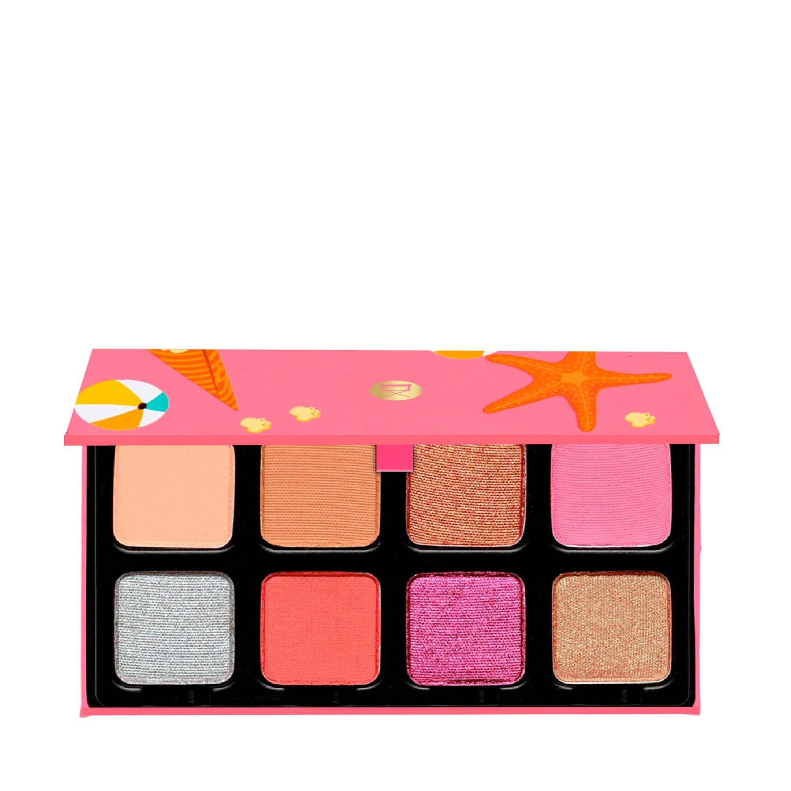

> 仲夏的沙滩、炫彩的遮阳伞、玫红的冰棒——Petit Pro Chou Chou 把最甜蜜的夏日记忆调入这8格颜料。鲜橙闪光与棉花糖热粉扑面而来，连冰凉的银色高光都带着阳光与海盐的气息。

> *A beachside fantasy in eight shades — vivid candy hues and sparkling shimmers inspired by bougainvillea in bloom, sun-kissed skin, and the glistening sea. Petit Pro Chou Chou is summer distilled into a palette.*

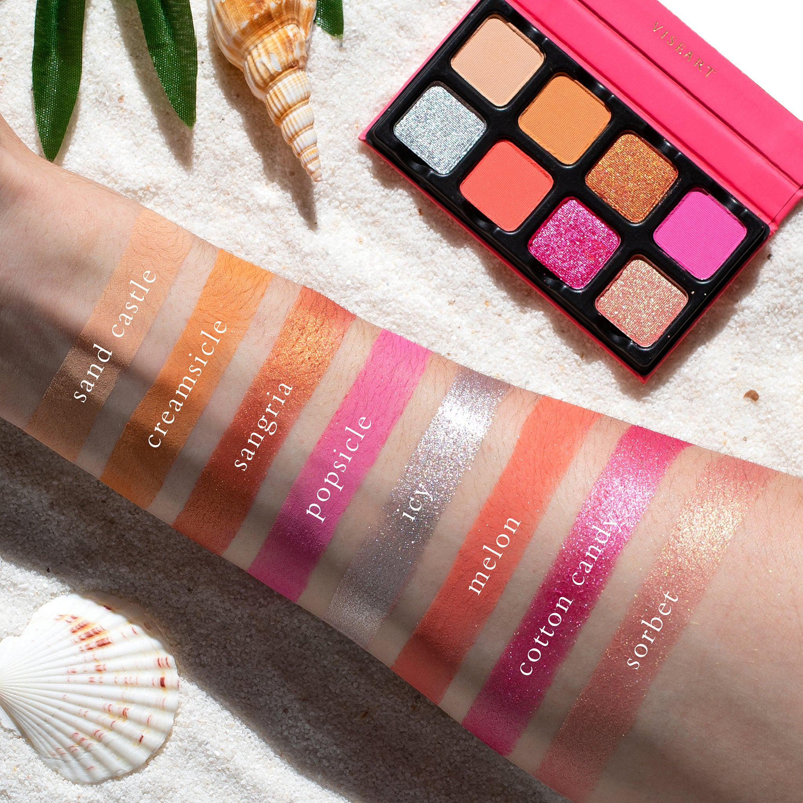
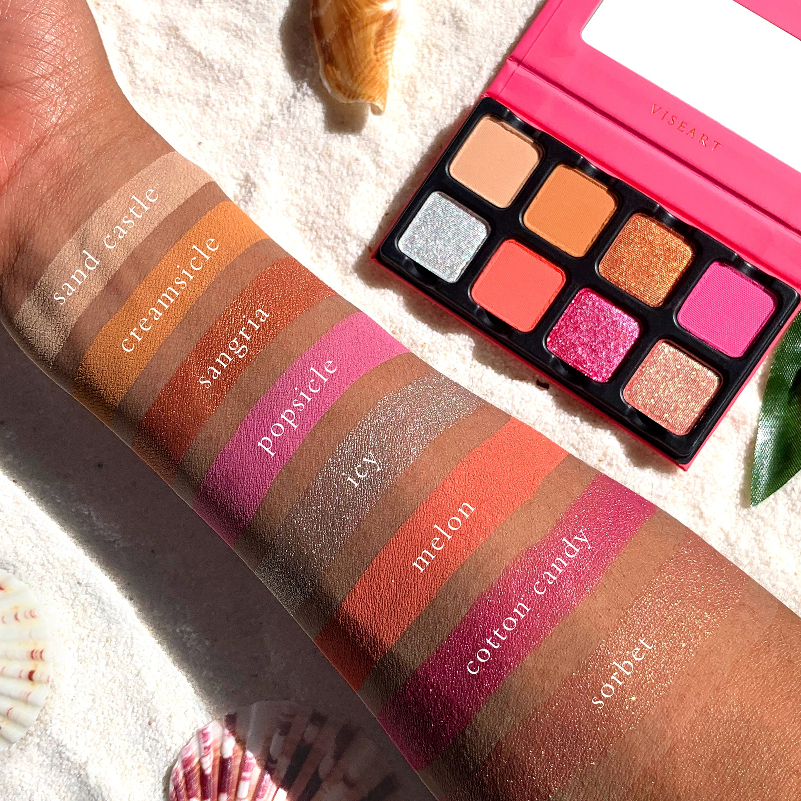

## Shade 1: Sand Castle — Sandy beige with a matte finish.
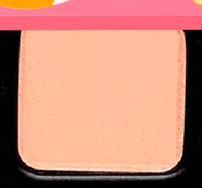

Use: Can be worn as an all over lid base color or used to add brightness to the inner corners of the eyes. An ideal brow bone highlight for all skin tones.

##### 色号 1：沙滩城堡米 (Sand Castle) —— 沙质米米色，哑光质地。
用途：可作全眼打底铺色，或用于眼头提亮；所有肤色均适合用作眉骨高光。

## Shade 2: Creamsicle — Warm brown with a matte finish.
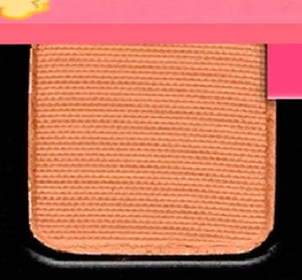

Use: This warm peachy brown can be used as an all over lid color or crease shade. Versatile for transitioning and blending with other hues.

##### 色号 2：橘子冰棒棕 (Creamsicle) —— 暖桃棕色，哑光质地。
用途：可作全眼铺色或眼窝渐变过渡色，与其他色号融合性极佳。

## Shade 3: Sangria — Orange with a shimmer finish.
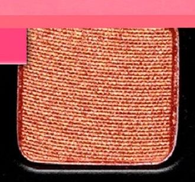

Use: Can be worn as an all over lid color or used with a mixing medium for a high shine metallic finish. Use in the outer corners of the eye for a pop of warmth.

##### 色号 3：桑格利亚橙闪 (Sangria) —— 鲜橙色，闪光质地。
用途：可作全眼铺色，或搭配调和液打造高闪金属感；点于眼尾增添橙艳暖意。

## Shade 4: Popsicle — Bubblegum pink with a matte finish.
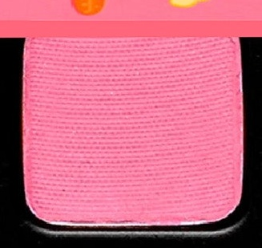

Use: This bright candy pink can be worn as an all over lid shade or used in the crease for a bold pop of color. Mix with neutrals to soften the intensity.

##### 色号 4：泡泡糖粉 (Popsicle) —— 泡泡糖亮粉，哑光质地。
用途：可作全眼鲜艳铺色，或叠于眼窝制造糖果色跳跃感；与中性色混合可降低饱和度。

## Shade 5: Icy — Silver with a metallic finish.
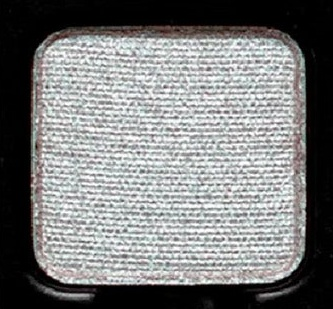

Use: Use as an all over lid shade for a striking metallic statement, or concentrate on the center of the lid and inner corner for a focal glow. Can be used as a brow bone and cheekbone highlighter.

##### 色号 5：冰银金属 (Icy) —— 银色，金属质地。
用途：可作全眼打造强烈金属感，或集中点在眼皮中央与眼头增添光芒焦点；也可用作眉骨与颧骨高光。

## Shade 6: Melon — Pink-red with a matte finish.
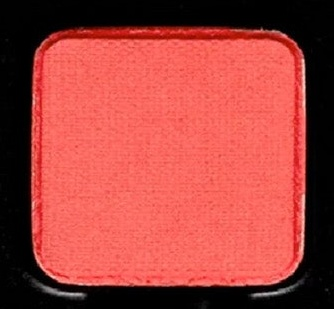

提示：在美国，此色含有 FDA 未批准用于眼部区域的色素。

Use: This punchy pink-red can be worn as an all over lid color or used in the outer corners and crease for depth and definition. Can also be used as a bold liner with a damp brush.

WARNING: In the US, this shade contains pigments that the FDA has not approved for use in the eye area.

##### 色号 6：蜜瓜玫红 (Melon) —— 粉红色，哑光质地。
用途：可作全眼鲜亮铺色，或叠加于眼尾与眼窝增添深度和轮廓感；可用湿刷作为浓郁眼线。

## Shade 7: Cotton Candy — Hot pink with a shimmer finish.
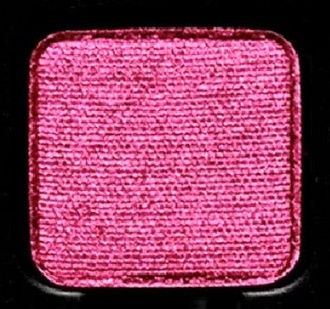

提示：在美国，此色含有 FDA 未批准用于眼部区域的色素。

Use: Can be worn as an all over metallic lid shade or layered over matte shades for extra dimension. Use in the inner corner for a pop of shimmer. Can be foiled for maximum intensity.

WARNING: In the US, this shade contains pigments that the FDA has not approved for use in the eye area.

##### 色号 7：棉花糖热粉 (Cotton Candy) —— 玫红热粉，闪光质地。
用途：可作全眼金属铺色，或叠加于哑光底色上增添层次；点于眼头制造闪光焦点；可打箔光提升强度。

## Shade 8: Sorbet — Shimmering peach with a duochrome finish.
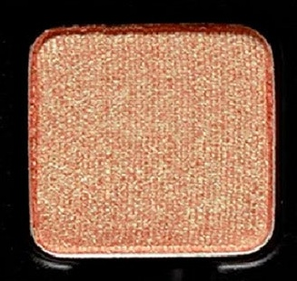

Use: This shimmering duochrome peach can be used as an all over lid shade that shifts with the light. Layer over matte bases for a multidimensional effect, or use on the inner corner for a fresh glow.

##### 色号 8：蜜桃雪葩幻彩 (Sorbet) —— 幻彩蜜桃色，双色光泽质地。
用途：可作全眼随光变幻的铺色，叠加于哑光底色上呈现多维效果；或点于眼头带来清透光感。
