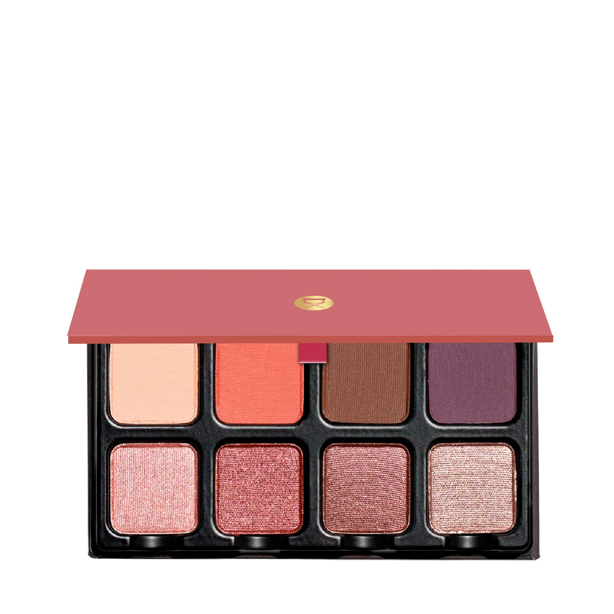
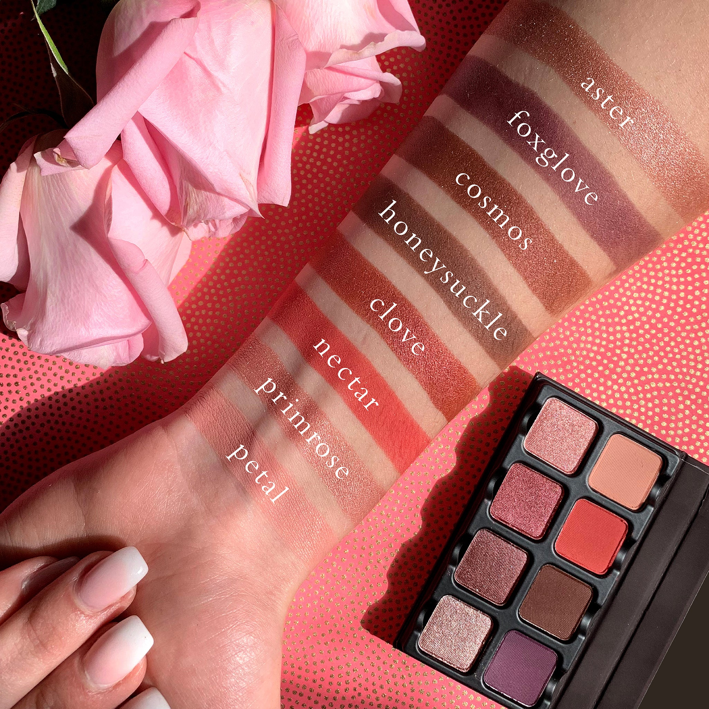
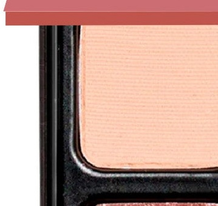
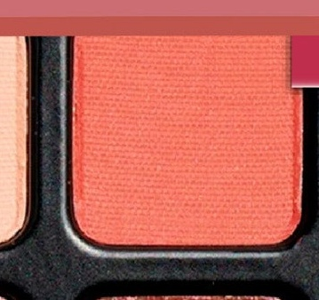
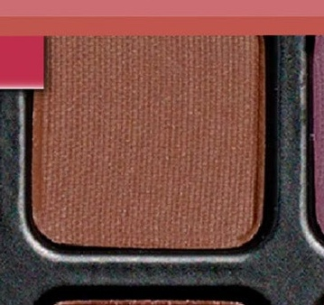
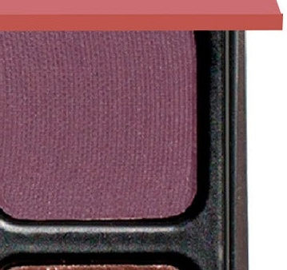
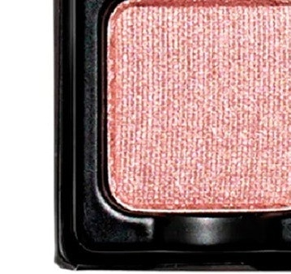
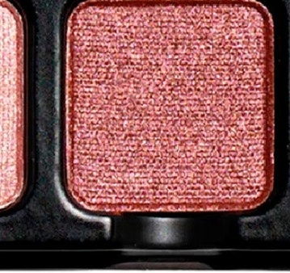
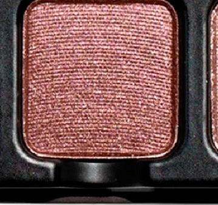
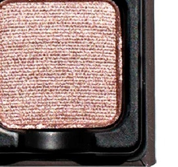

# Viseart 8色 小号 莓粉绮彩盘 Petit Pro Deux
*发布：2020*

> 浆果系的私密交响曲。桃粉、珊瑚、玫蔻与宇宙紫，从娇嫩哑光到多维闪光，Petit Pro Deux 的8个色调像一段悠扬旋律，任何层次叠搭都能奏出恰到好处的甜蜜深度。

> *A berry-rich symphony in eight movements. Blendable peachy mattes give way to layered shimmer — from the softest petal pink to a sultry purple mauve — Petit Pro Deux composes sweetness and depth in equal measure.*

## Shade 1: Petal — Peachy pink with a matte finish.

Use: All over base tone from lash to brow, to brighten the inner corner of the eye, to subtly highlight and structure the face.

##### 色号 1：花瓣玫粉 (Petal) —— 桃粉色，哑光质地。
用途：可从睫毛根部到眉骨作全眼打底铺色，用于眼头提亮，或作面部细节的柔和高光。

## Shade 2: Nectar — Coral pink with a matte finish.

Use: Base tone for all skin types, can be used as a highlighter for deeper tones, a midtone for lightest skin tones. This super versatile color can be mixed with any of the other tones to lighten and brighten them. It can also be used to highlight anywhere on the face for light skin tones — try it under the brow, on top of the cheekbone, or the inner corner of the eye. Also used as a blush and contour for light skin.

##### 色号 2：珊瑚花粉 (Nectar) —— 珊瑚粉，哑光质地。
用途：适合所有肤色的打底色；深肤色可作高光，浅肤色可作中间色；可与任何色号混合提亮；浅肤色还可用于眉下、颧骨上方、眼头的面部高光，以及腮红和修容。

## Shade 3: Honeysuckle — Burnished brown with a matte finish.

Use: Create a dark brown smokey eye, use as an eyeliner with a wet brush, add dimension to corners of eyes. This tone can be used in brows and mixed into other mattes to create contour for deeper skin tones.

##### 色号 3：忍冬燃棕 (Honeysuckle) —— 燃棕色，哑光质地。
用途：可打造深棕烟熏眼，用湿刷作眼线，或叠于眼角增添立体感；可用于修眉，或与其他哑光色混合为深肤色塑造轮廓。

## Shade 4: Foxglove — Classic purple with a matte finish.

Use: Use at lash line as liner, or blend into light matte base tones to create depth and shape. For a deeper matte smokey eye, mix into darker tones. Can be used as a base tone and topped with the lightest shimmer for an icy iridescent effect.

##### 色号 4：毛地黄紫 (Foxglove) —— 经典紫罗兰，哑光质地。
用途：可沿睫毛根部作眼线，或融入浅色哑光底色增加眼型立体感；可打造深邃哑光烟熏眼；也可作底色再叠上最浅闪光色，呈现冰感幻彩效果。

## Shade 5: Primrose — Cool pink with a shimmer finish.

Use: All over eye for natural eye-enhancing metallic sheen, can be mixed into any matte tone to transform any matte shade into a metallic shade, also can be used as a highlight.

##### 色号 5：月见草冷粉 (Primrose) —— 冷调粉，闪光质地。
用途：可作全眼自然增亮金属感铺色；可与任意哑光色混合将其转化为金属质地；也可用作高光。

## Shade 6: Clove — Raspberry pink with a shimmer finish.

Use: All over eye for natural eye-enhancing metallic sheen, can be mixed into any matte tone to transform any matte shade into a metallic shade.

##### 色号 6：覆盆子玫蔻 (Clove) —— 覆盆莓粉，闪光质地。
用途：可作全眼金属光泽铺色；可与任意哑光色混合将其转化为金属质地。

## Shade 7: Cosmos — Purple mauve with a shimmer finish.

Use: All over eye for natural eye-enhancing metallic sheen, can be mixed into any matte tone to transform any matte shade into a metallic shade.

##### 色号 7：宇宙紫藕 (Cosmos) —— 紫藕金属，闪光质地。
用途：可作全眼金属光感铺色；可与任意哑光色混合将其转化为金属质地。

## Shade 8: Aster — Light icy purple with a shimmer finish.

Use: All over eye for natural eye-enhancing metallic sheen, can be mixed into any matte tone to transform any matte shade into a metallic shade, also can be used as a highlight.

##### 色号 8：冰紫紫苑 (Aster) —— 浅冰紫，闪光质地。
用途：可作全眼轻透金属感铺色；可与任意哑光色混合将其转化为金属质地；也可用作高光。
