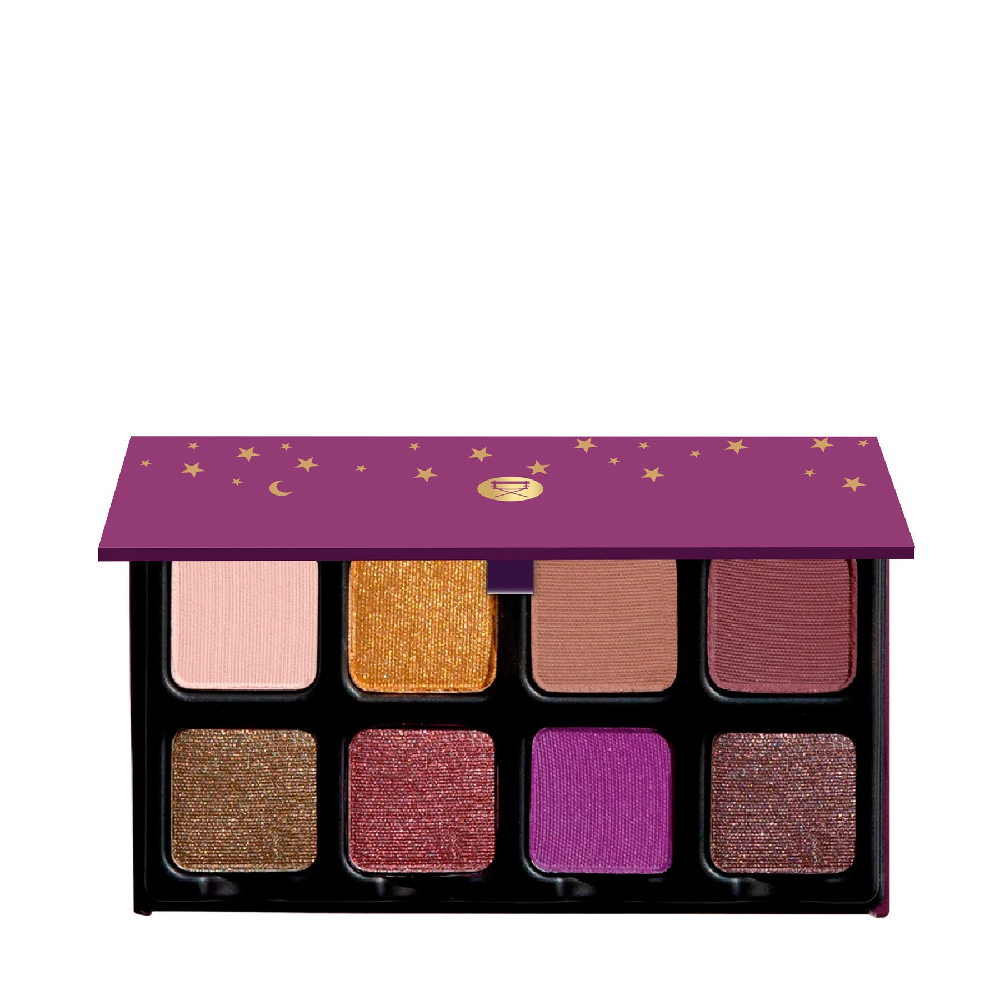
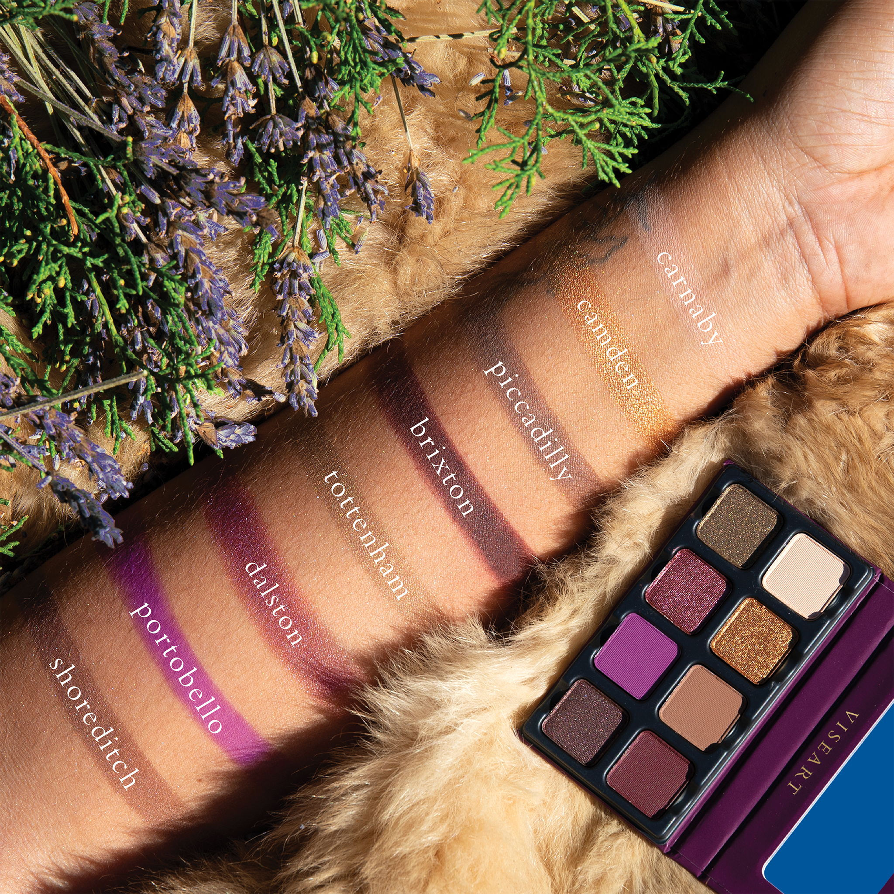
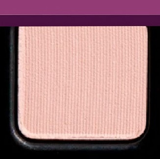
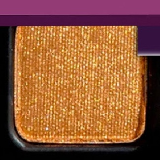
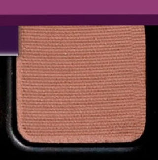
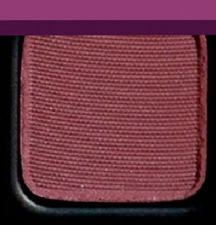
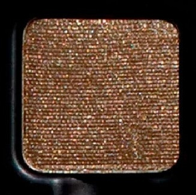
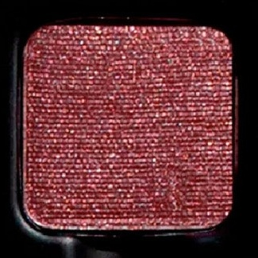
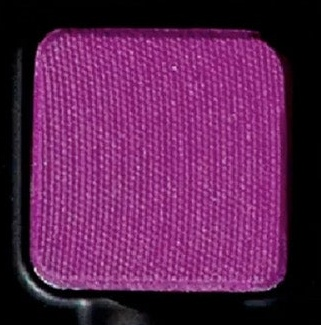
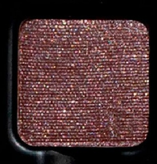

# Viseart 8色 小号 伦敦星辰盘 Petit Pro London Étoile
*发布：2022*

> 这不是一盒安静的颜色——它属于伦敦的夜晚。皇室紫、燃金与天鹅绒梅红，在街头霓虹与剧院幕布之间共鸣。从卡纳比街的奶油雾感到肖尔迪奇的烟紫闪光，Petit Pro London Étoile 让整座城市的色彩故事随手涂在眼皮上。

> *Not a quiet palette — this is London after dark. Regal purples, burnished gold, and velvety merlot resonate between lit-up alleyways and theatre curtains. Petit Pro London Étoile distills the city's eclectic character into eight shades that move seamlessly from Carnaby's creamy haze to Shoreditch's smoky metallic plum.*

## Shade 1: Carnaby — Light cream beige with a matte finish.

Use: Can be worn as an all over lid color for light to medium complexions or used to add brightness to the inner corners of the eyes, and for highlighting the brow bone for all skin tones.

##### 色号 1：卡纳比奶油米 (Carnaby) —— 浅奶白米色，哑光质地。
用途：适合浅至中肤色作全眼铺色，或用于眼头提亮；所有肤色均可用作眉骨高光。

## Shade 2: Camden — Neutral deep gold with a metallic satin finish.

Use: This burnished gold can be used as an all over lid shade or used with a mixing medium for a high shine metallic finish. Use in the corner of the eye for a pop of brightness and mix in with other hues to lighten the shade or deepen for a myriad of shades.

##### 色号 2：卡姆登燃金 (Camden) —— 中性深金色，金属缎光质地。
用途：可作全眼铺色，或搭配调和液打造高闪金属感；点于眼角增添明艳光感；可与其他色号混合调出由浅至深的多重色调。

## Shade 3: Piccadilly — Medium neutral-toned light latte brown with a matte finish.

Use: This versatile tone can be used as an all over lid color on all complexions. Can also be used as a base tone for deep complexions or as a brow color for light and medium toned brows. Mix in with the other matte hues to create new tones deeper to lighter, mix with reflective hues to create depth and dimension.

##### 色号 3：皮卡迪利拿铁棕 (Piccadilly) —— 中性轻拿铁棕，哑光质地。
用途：适合所有肤色全眼铺色；深肤色可作打底；浅至中色调眉毛可用作修眉色；与哑光色混合延展层次，与闪光色叠加增加立体感。

## Shade 4: Brixton — Boysenberry purple with a matte finish.

Use: Use this rich plummy burgundy hue as a wash of color all over the lid or build up and concentrate the shade in the outer corners of the eye for depth and dimension, use as a crease tone to add depth and dimension. This hue can also be used as a liner with a damp brush.

##### 色号 4：布里克斯顿桑葚紫 (Brixton) —— 桑葚暗紫色，哑光质地。
用途：可轻薄铺陈全眼，或集中叠加于眼尾增添立体轮廓；用作眼窝渐变可加深层次；可用湿刷作眼线。

## Shade 5: Tottenham — Muted sage taupe with a metallic duochromatic shimmer finish.

Use: Can be worn as an all over lid shade on all complexions. Use in conjunction with a mixing medium to foil the hue for extra depth and reflectivity. Can be used as a liner with a damp brush. Mix with the matte hues to create more shades, as well as define with all over lid and a pop of berries tones.

##### 色号 5：托特纳姆幻彩鼠尾草 (Tottenham) —— 哑彩鼠尾草棕金幻色，金属双色光泽质地。
用途：适合所有肤色全眼铺色；搭配调和液可打造极强金属箔光感；可湿刷作眼线；与哑光色混搭可创造更多层次，配合莓系色调更显轮廓清晰。

## Shade 6: Dalston — Burgundy plum with a metallic satin finish.

Use: Use this mid-tone raspberry as an all over lid color or layer over your favorite matte or shimmer shades for an extra pop. Can be foiled or worn as liner.

##### 色号 6：道尔斯顿勃艮第梅 (Dalston) —— 勃艮第李子色，金属缎光质地。
用途：可作全眼铺色，或叠加于哑光/闪光底色上增添跳跃光感；可打箔光或作眼线使用。

## Shade 7: Portobello — Mid tone fuchsia purple with a matte finish.

Use: This bright fuchsia shade can be worn as an all over lid shade or used as liner for a pop of colorful definition, it can be mixed into other tones to create different shades.

##### 色号 7：波托贝洛荧光玫紫 (Portobello) —— 中调荧光玫紫，哑光质地。
用途：可作全眼鲜艳铺色，或用作眼线打造高饱和色彩轮廓；可与其他色号混合调出不同层次。

## Shade 8: Shoreditch — Soft metallic plum with a shimmer finish.

Use: Use this muted plum tone as an all over lid color or layer over your favorite matte or shimmer shades for an extra pop. Can be foiled or worn as liner.

##### 色号 8：肖尔迪奇烟紫闪 (Shoreditch) —— 柔和金属烟紫色，闪光质地。
用途：可作全眼铺色，或叠加于哑光/闪光底色上增添层次感；可打箔光或作眼线使用。
