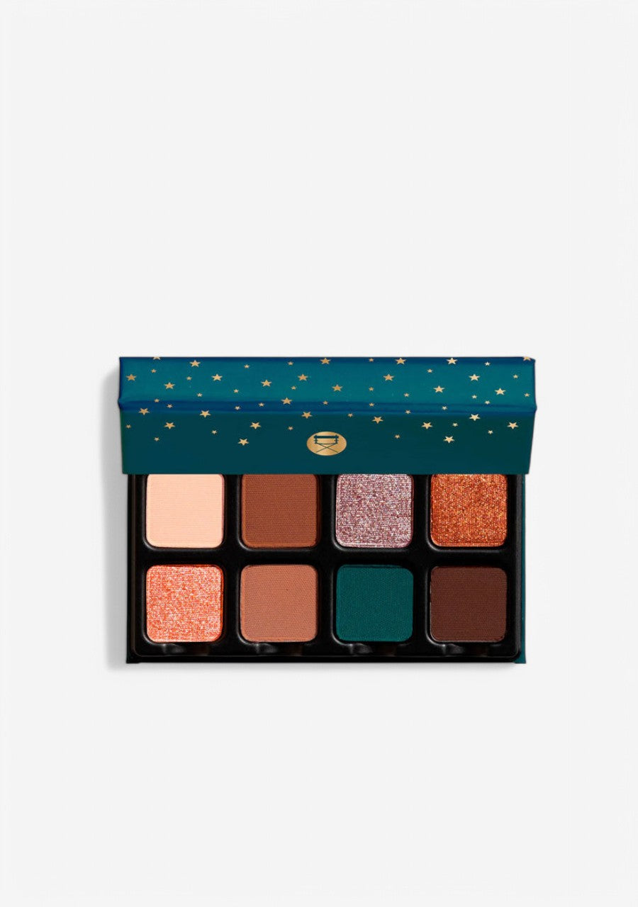
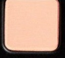
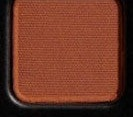
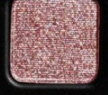
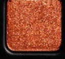
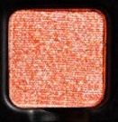
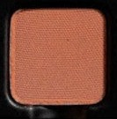
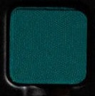
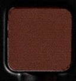

# Viseart 8色 小号 旧金山星辰盘 Petit Pro San Francisco Étoile
*发布：~2023*

> 旧金山不只有金门大桥——她是各种色彩、各种故事并存的城市。从费尔摩尔的珊瑚爵士光，到卡斯特罗街的玫瑰闪艳，再到美滨的深邃翠青，Petit Pro San Francisco Étoile 把这座城市的缤纷魂魄收入八格之中。

> *From the jazz-lit warmth of Fillmore to the teal stillness of the Bay and the rosy defiance of Castro — Petit Pro San Francisco Étoile captures the city's electric, eclectic character. Eight shades as layered and unforgettable as San Francisco itself.*

## Shade 1: Union — Light peach with a matte finish.

Use: All over lid base tone for all skin types, brow bone highlight, or blending shade. Named for Union Square, the heart of the city.

##### 色号 1：联合广场裸肤 (Union) —— 浅桃裸色，哑光质地。
用途：适合所有肤色的全眼打底铺色，眉骨高光，或融合过渡色。

## Shade 2: Lombard — Medium warm brown with a matte finish.

Use: All over lid mid-tone, crease definition, or natural everyday shadow. Named for the famously winding Lombard Street.

##### 色号 2：九曲花街暖棕 (Lombard) —— 中调暖棕色，哑光质地。
用途：可作全眼中间铺色，眼窝立体定型，或日常自然色号。

## Shade 3: Castro — Rose pink with a shimmer finish.

Use: All over lid for a rosy metallic glow, inner corner highlight, or layered over warm mattes for added brilliance. Named for the vibrant Castro District.

##### 色号 3：卡斯特罗玫瑰闪 (Castro) —— 玫瑰粉，闪光质地。
用途：可作全眼铺色呈现玫瑰金属光感，眼头高光，或叠加于暖色哑光上增添光彩。

## Shade 4: Golden Gate — Copper rust with a shimmer finish.

Use: All over lid for a warm metallic wash, or concentrate on the outer corner for a pop of copper warmth. Named for San Francisco's iconic bridge.

##### 色号 4：金门铜光 (Golden Gate) —— 铜锈橙色，闪光质地。
用途：可作全眼暖调金属铺色，或集中点于眼尾增添铜橙暖意。

## Shade 5: Fillmore — Coral with a shimmer finish.

Use: All over lid for a luminous coral effect, or layered over warm peachy mattes. Named for the historic Fillmore jazz district.

##### 色号 5：费尔摩尔珊瑚闪 (Fillmore) —— 珊瑚橙色，闪光质地。
用途：可作全眼铺色打造珊瑚光感，或叠加于暖调桃粉哑光之上。

## Shade 6: Presidio — Warm brown with a matte finish.

Use: Crease work, outer corner depth, or all over lid for a natural warm look. Named for the forested Presidio park.

##### 色号 6：普雷西迪奥暖棕 (Presidio) —— 暖棕色，哑光质地。
用途：可作眼窝定型，眼尾深度，或全眼铺色打造自然暖调妆效。

## Shade 7: Marina — Dark teal with a matte finish.

Use: Intense all over lid for a graphic color statement, liner along the lash line, or outer corner depth for a teal smokey eye. Named for the Marina District on the bay.

##### 色号 7：美滨深翠青 (Marina) —— 深翠碧绿色，哑光质地。
用途：可作全眼铺色打造强烈色彩宣言，沿睫毛根部作眼线，或叠加于眼尾打造翠绿烟熏眼。

## Shade 8: Ghirardelli — Deep dark brown with a matte finish.

Use: Smokey liner, extreme outer corner depth, or blended under other shades for shadow dimension. Named for the landmark Ghirardelli Square chocolate factory.

##### 色号 8：吉拉德利深棕 (Ghirardelli) —— 极深棕色，哑光质地。
用途：可作烟熏眼线，眼尾极深轮廓，或融入其他色号之下增添阴影层次。
