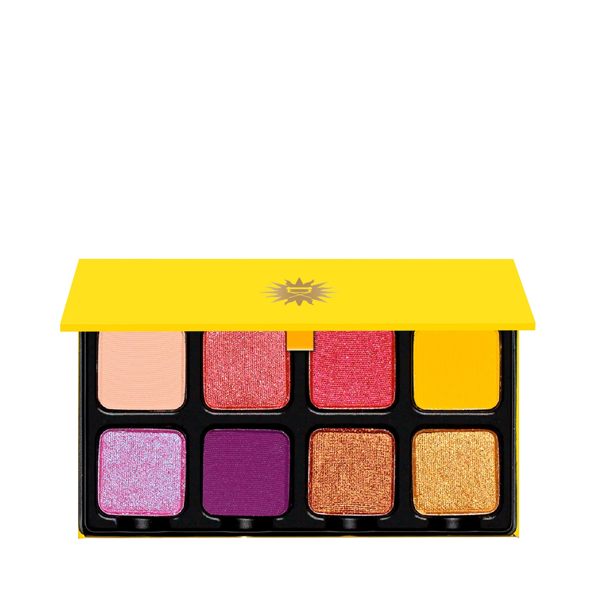
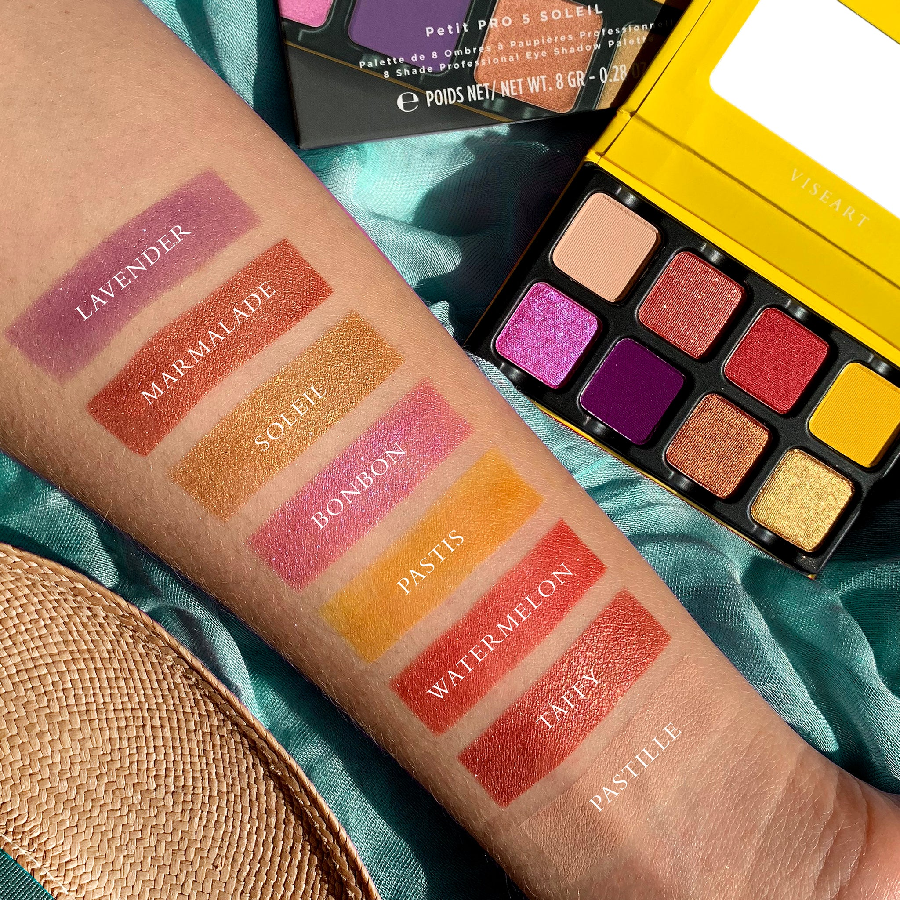
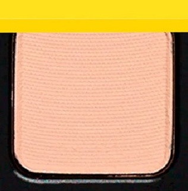
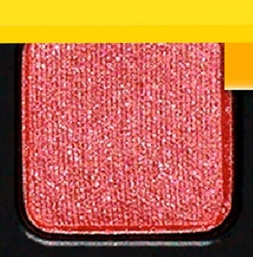
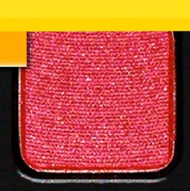
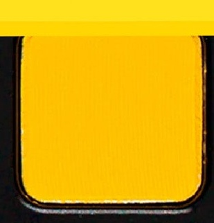
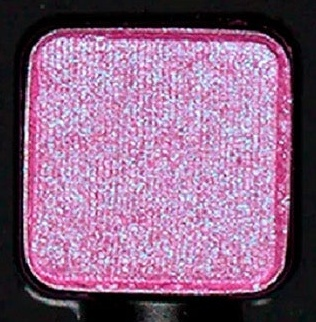
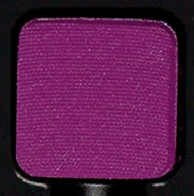
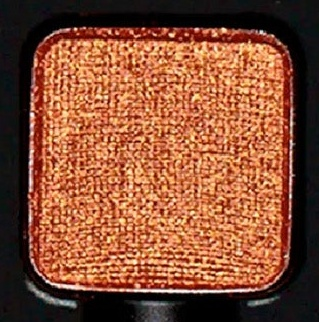
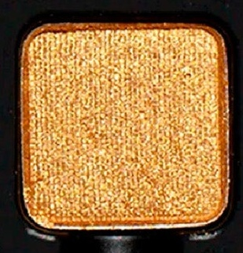

# Viseart 8色 小号 日曜艳彩盘 Petit Pro Soleil
*发布：2020*

> 不是轻描淡写的夏天，而是最饱和的那一种——西瓜红、幻变莓蓝与日曜黄金，用色彩拼出最大声的热情。果味哑光与气泡闪光交织，Petit Pro Soleil 是拒绝普通的彩妆宣言。

> *Saturated and unapologetic — this is summer at full volume. Fruity mattes meet effervescent shimmers in sunny tropical tones, from cherry blossom ice to sun-kissed gold. Petit Pro Soleil refuses to be quiet.*

## Shade 1: Pastille — Light, warm-toned taupe with a matte finish.

Use: Can be worn as an all over lid base for all complexions or used as a brow bone highlight. A versatile blending shade that works with all other tones in the palette.

##### 色号 1：暖棕糖片 (Pastille) —— 浅暖棕豆沙色，哑光质地。
用途：适合所有肤色作全眼打底或眉骨高光；与本盘所有色号融合性极高。

## Shade 2: Taffy — Iced cherry blossom with a shimmer finish.

Use: Can be worn as an all over shimmer lid shade or concentrated on the center of the lid and inner corner for a bright focal glow. Can also be used as a highlight on the brow bone and cheekbone.

##### 色号 2：樱花太妃闪 (Taffy) —— 冰樱花粉，闪光质地。
用途：可作全眼轻薄闪光铺色，或集中于眼皮中央与眼头打造明亮焦点；也可用于眉骨和颧骨高光。

## Shade 3: Watermelon — Medium-toned red with a shimmer finish.

Use: This vibrant red shimmer can be worn as an all over lid shade for a bold statement, or layered over matte shades for depth and brilliance. Can be foiled with a mixing medium for maximum intensity.

##### 色号 3：西瓜红闪 (Watermelon) —— 中调西瓜红，闪光质地。
用途：可作全眼铺色打造大胆宣言感，或叠加于哑光底色上增添光泽层次；搭配调和液可打造极强箔光。

## Shade 4: Pastis — Medium, warm-toned citron with a matte finish.

Use: This warm yellow-green matte can be used as an all over lid color for a graphic look, or blended into the crease for an unexpected pop of color. Mix with neutrals to create custom warm tones.

##### 色号 4：柠檬茴香哑光 (Pastis) —— 中调暖柠檬绿，哑光质地。
用途：可作全眼铺色制造高饱和图形感，或融于眼窝带来出人意料的色彩跳跃；与中性色混合可调出定制暖调。

## Shade 5: Bonbon — Iced violet-blue duochrome with a high shine finish.

Use: This icy duochrome can be worn as an all over lid shade that shifts between violet and blue with the light. Use in the inner corner for a luminous pop, or layer over dark mattes for a foiled effect.

##### 色号 5：冰莓幻彩 (Bonbon) —— 冰感紫蓝幻彩，高光泽双色质地。
用途：可作全眼随光变色铺色（紫蓝间幻变），点于眼头增添发光感，或叠于深色哑光上制造箔光效果。

## Shade 6: Lavender — Byzantine purple with a matte finish.

Use: This rich purple matte can be used all over the lid for a dramatic wash of color, or concentrated in the crease and outer corners for depth and definition. Can also be used as a liner with a damp brush.

##### 色号 6：拜占庭紫薰衣草 (Lavender) —— 拜占庭紫，哑光质地。
用途：可作全眼戏剧性铺色，或集中于眼窝与眼尾增添深度与轮廓感；也可用湿刷作眼线使用。

## Shade 7: Marmalade — Terracotta with a shimmer finish.

Use: This warm terracotta shimmer can be worn as an all over lid shade or used as a transitional hue in the crease. Layer over matte shades to add warmth and dimension.

##### 色号 7：橙皮陶土闪 (Marmalade) —— 陶土橙，闪光质地。
用途：可作全眼暖调铺色，或作眼窝渐变过渡色；叠于哑光底色上增添暖度与立体感。

## Shade 8: Soleil — Yellow gold with a shimmer finish.

Use: This sun-kissed golden shimmer can be worn all over the lid for a radiant look, or used as a highlight on the center of the lid, inner corner, brow bone, and cheekbones.

##### 色号 8：日曜暖金 (Soleil) —— 黄金色，闪光质地。
用途：可作全眼铺色打造日光辉耀感，或用作眼皮中央、眼头、眉骨及颧骨的高光提亮。
